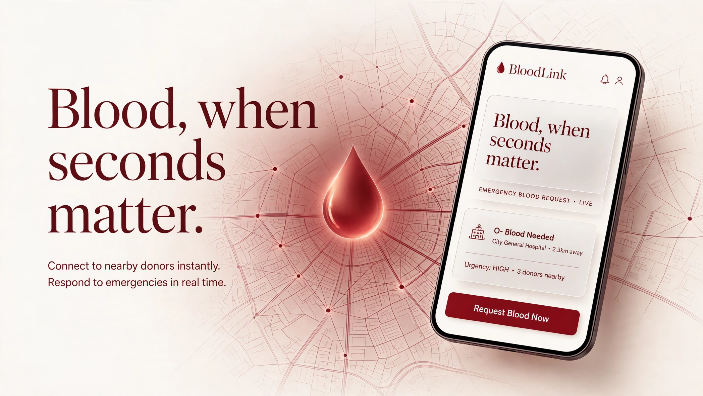

<div align="center">

# 🩸 BloodLink

### *Blood, when seconds matter.*




**An AI-powered emergency blood donor network for Pakistan** — connecting blood donors with patients in need, within minutes.

</div>

---

## What is BloodLink?

In Pakistan, finding blood in an emergency still runs on panicked phone calls, WhatsApp forwards, and luck. Requests get lost, donors who want to help never hear about them, and families lose precious hours.

**BloodLink fixes this.** A family posts one request — blood group, hospital, city. The system scores compatible donors nearby on three signals (compatibility × proximity × availability) and alerts the top matches instantly. A donor taps *accept*, donates, and a life is saved. Simple.

> For the plain-English version of the idea, read [`PITCH.md`](PITCH.md).

---

## ✨ Features

- 🩸 **Emergency requests** — post a request with blood group, units, hospital, city, and urgency; track it through a live status timeline (requested → matching → alerted → responding → fulfilled)
- 🤖 **AI match scoring** — every candidate donor is ranked by *compatibility × proximity × availability*; incompatible groups score zero and drop out immediately
- 🔔 **Instant alerts** — top-matched donors receive push notifications (WhatsApp-style alerts simulated in this version)
- 🔍 **Find donors** — searchable donor directory with blood-group, city, and availability filters
- 👥 **Dual dashboards** — dedicated home bases for **donors** (alerts, donation history, profile) and **hospitals** (requests, demand forecasts)
- 🗓️ **Blood drives** — browse and register for donation camps and drives
- ✅ **Eligibility checker** — interactive self-check (age, weight, hemoglobin, recent illness/tattoos/medication) before registering as a donor
- 📚 **Learn hub** — articles on donation basics, myths, and aftercare
- 💌 **Stories** — donor and recipient-family stories from the community
- 🔐 **Auth flows** — sign up, login, email verification, and password reset screens
- 🧾 **Full compatibility reference** — all 8 blood groups with donor/recipient charts and notes

> **Status:** This repo is the frontend. It currently runs entirely on clearly-marked **demo data** (`lib/demo.ts`) — no real people, hospitals, or medical data. The Firebase backend (auth, Firestore, push) is stubbed in `lib/firebase.ts` and not yet connected.

---

## 🛠 Tech Stack

| Layer | Technology |
|---|---|
| Framework | Expo (SDK 57) + Expo Router (file-based routing, typed routes) |
| UI | React Native 0.86, React 19, TypeScript |
| Styling | NativeWind 4 (Tailwind CSS) with a custom warm-editorial design system (`styles/theme.ts`) |
| Animation | Reanimated 4 + Gesture Handler (spring physics, magnetic buttons, parallax, tilt cards) |
| Typography | Fraunces (display), Inter (sans), IBM Plex Mono (labels) via `@expo-google-fonts` |
| Backend (planned) | Firebase — Auth, Firestore, Cloud Functions (TypeScript: matching, forecasting, fraud detection, alerts), Cloud Messaging |
| Platforms | Android · iOS · Web — one codebase |

**Design language:** warm paper surfaces (`#FAF9F7`), deep maroon dark sections, one crimson accent reserved for CTAs and urgency, frosted-glass cards, hairline borders instead of shadows.

---

## 🚀 Getting Started

**Prerequisites:** Node.js 18+ and the [Expo Go](https://expo.dev/go) app (for testing on a phone).

```bash
# 1. Install dependencies
npm install

# 2. Start the dev server
npx expo start
```

Then press `a` for Android, `i` for iOS, or `w` for web — or scan the QR code with Expo Go.

**Web build** (for Vercel or any static host):

```bash
npm run build   # expo export --platform web
```

**Typecheck:**

```bash
npm run typecheck
```

---

## 📸 Screenshots

Screenshots are coming soon — the app is still in active development.

---

## 📁 Project Structure

```
app/              # Expo Router screens (file-based routing)
├── (auth)/       # login, signup, verify-email, forgot-password
├── (donor)/      # donor dashboard, alerts, history, profile
├── (hospital)/   # hospital dashboard, requests, forecasts
├── drives/       # blood drives listing + detail
├── learn/        # donation articles + detail
├── requests/     # new request flow + request detail/timeline
├── stories/      # community stories + detail
components/       # ui/ · motion/ · layout/ · home/ · donors/ · requests/ · dashboard/
lib/              # demo.ts (demo data), firebase.ts (stub), validators, matching utils
styles/           # theme.ts (design tokens), fonts.ts, global.css
assets/           # hero banner + app assets
PITCH.md          # plain-English explanation of the idea
```

---

## 🗺 Roadmap

- [x] Frontend v1 — all screens, warm editorial design, demo data
- [ ] Firebase Auth + Firestore connection
- [ ] TypeScript Cloud Functions (AI matching, demand forecasting, fraud detection, alerts)
- [ ] Real push notifications (Expo Push) + WhatsApp alerts
- [ ] Android APK via Expo (sideload) · iOS via Expo Go · web on Vercel

---

## 🤝 Contributing

This is a personal project and the repo is private. If you've been given access and want to help, open an issue first to discuss what you'd like to change.

## 📄 License

MIT — free to learn from and build upon.

---

<div align="center">

Made with ❤️ by **Hussnain Ahmad** — [github.com/hussnainahmedd](https://github.com/hussnainahmedd)

</div>
