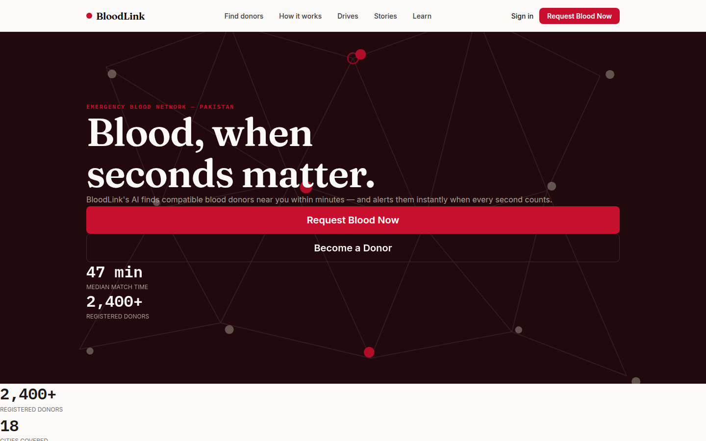
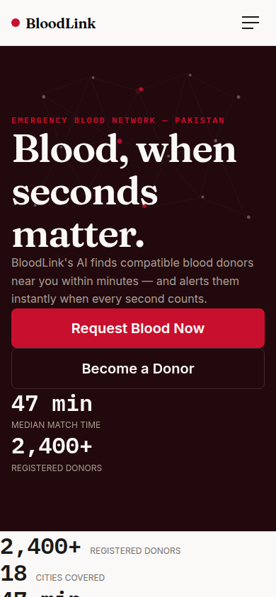
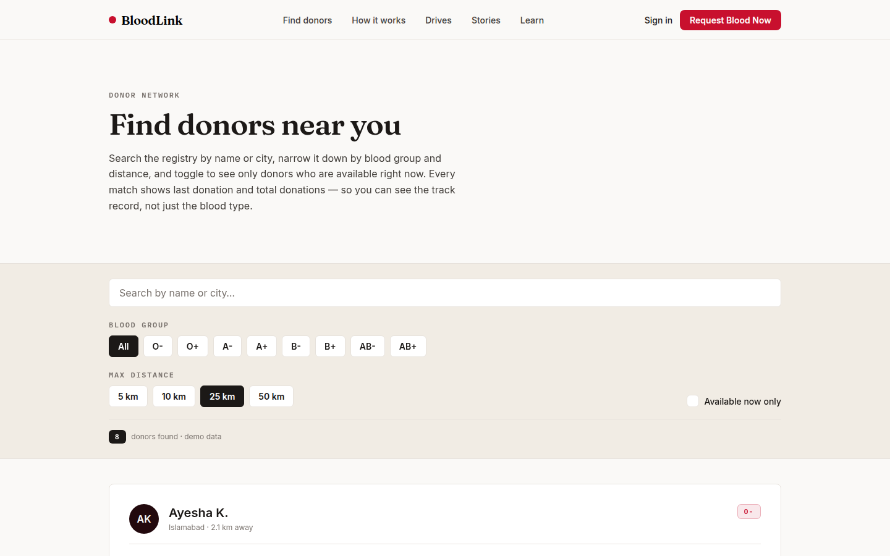
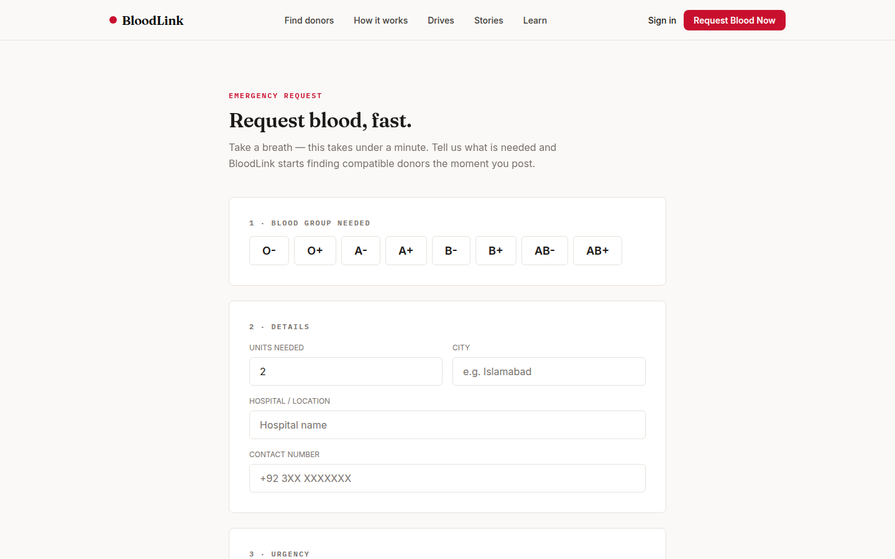

# 🩸 BloodLink — Emergency Blood Donor Matching

> **Open-source showcase project by [Hussnain Ahmad](https://github.com/hussnainahmedd)** —
> finding the right blood donors within minutes, instead of hours of WhatsApp forwards.


**🌐 Live demo (web, demo data):** https://bloodlink-amber.vercel.app/

## Screenshots

| Home (desktop) | Home (mobile) |
|---|---|
|  |  |

| Find donors | New emergency request |
|---|---|
|  |  |

---

## ⚠️ Important disclaimer

BloodLink is a **prototype built for learning and demonstration**. Everything in
the app today runs on clearly-marked fictional demo data (`lib/demo.ts`):

- It is **not** connected to any hospital or blood bank.
- It must **not** be used to request or offer real blood donations.
- It is **not** a medical service and gives no medical advice beyond general,
  publicly-known blood-donation eligibility information.

If you need blood in an emergency, contact your hospital's blood bank or your
local emergency services directly.

---

## The idea

In emergencies in Pakistan, finding a blood donor still runs on phone calls,
WhatsApp forwards, and luck. Requests get lost, nobody knows which ones are
still open, and willing donors nearby never hear about them.

BloodLink fixes the flow:

1. **Request** — a hospital or patient's family posts a request (blood group,
   units needed, hospital, city). Under a minute.
2. **Match** — a matching engine scores donors by blood compatibility,
   distance, availability, and time since last donation.
3. **Alert** — the top-matched donors get an instant alert and can accept or
   decline. A donor's phone number stays hidden until they accept.
4. **Donate** — the request tracks live from *requested → matching → alerted →
   responding → fulfilled*.

**One-line pitch:** *BloodLink finds compatible blood donors near a patient
within minutes and alerts them instantly — no searching, no forwarded messages.*

---

## Current status (honest version)

| Part | Status |
|---|---|
| Frontend (Android / iOS / Web from one Expo codebase) | ✅ **v1 complete** — home, find donors, emergency request flow, blood-group guide, eligibility checker, drives, stories, knowledge hub, donor & hospital dashboards |
| Demo data layer (`lib/demo.ts`) | ✅ Complete — the whole UI runs without a backend |
| Backend (Firebase Auth + Firestore) | 🚧 Not started — see [ROADMAP.md](ROADMAP.md) |
| Matching engine (TypeScript Cloud Functions) | 🚧 Designed, not implemented — `lib/matching.ts` and `functions/src/matching.ts` are stubs awaiting implementation |
| Alerts | 🚧 Push notifications planned; WhatsApp-style alert is **simulated in-app** in v1 (the real WhatsApp Business API is pluggable later) |

Contributions toward the 🚧 items are exactly what this project is open for.
See [docs/GOOD_FIRST_ISSUES.md](docs/GOOD_FIRST_ISSUES.md).

## Tech stack

- **App:** React Native + TypeScript, [Expo](https://expo.dev) + Expo Router,
  NativeWind — one codebase ships Android, iOS, and Web
- **Backend (planned):** Firebase — Authentication, Firestore, Cloud Messaging
- **Matching engine (planned):** TypeScript Firebase Cloud Functions
  (blood compatibility × proximity × availability). *No Python anywhere —
  the whole stack is TypeScript.*
- **Design:** warm editorial system (Fraunces / Inter / IBM Plex Mono),
  physics-based motion (springs, inertia, parallax) with full
  `prefers-reduced-motion` support

**Budget: $0, by design.** Free tiers only — Firebase Spark plan, Expo free
tier. Android ships as a directly installable APK (no Play Store fee), iOS runs
via Expo Go (no Apple Developer fee), and WhatsApp alerts are simulated in v1
(no WhatsApp Business API fee). Please don't propose paid services.

## Run it locally

```bash
git clone https://github.com/hussnainahmedd/bloodlink.git
cd bloodlink
npm install
npm run web        # web version
npm start          # then press a for Android / i for iOS (Expo Go)
npm run typecheck  # TypeScript check — must pass before any PR
```

No environment variables are needed yet: the app runs entirely on demo data.
When Firebase lands, copy `.env.example` to `.env` and fill in your own
(free-tier) Firebase project values.

## Contributing

Contributions are very welcome — code, tests, docs, translations (Urdu
especially), accessibility fixes, and design polish.

- Start with [CONTRIBUTING.md](CONTRIBUTING.md)
- Pick something from [docs/GOOD_FIRST_ISSUES.md](docs/GOOD_FIRST_ISSUES.md)
  or the `good first issue` label
- Please read [SECURITY.md](SECURITY.md) before anything touching donor data
  or contact details — the privacy rules there are non-negotiable

## Roadmap

See [ROADMAP.md](ROADMAP.md). Short version: Firebase auth → Firestore data
layer behind the existing demo-data interfaces → real matching engine in Cloud
Functions → push alerts → hospital demand forecasting.

## About

Built by **Hussnain Ahmad** — BSCS student at Air University, Islamabad,
working at the intersection of AI and real-world problems in Pakistan.

- GitHub: [@hussnainahmedd](https://github.com/hussnainahmedd)
- LinkedIn: [hussnainn](https://www.linkedin.com/in/hussnainn)

## License

MIT — see [LICENSE](LICENSE). Free to learn from and build upon. If you build
something real for blood donation on top of this, that's the best possible
outcome — just keep the disclaimer honest and never ship demo data as if it
were a live service.
